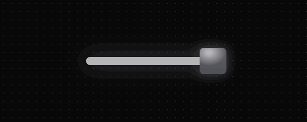
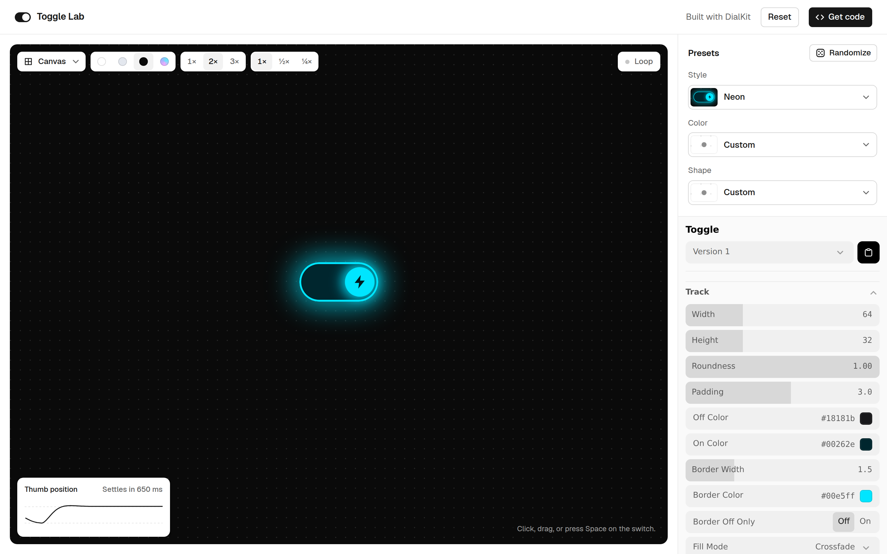

# Toggle Lab

A playground for designing switch components. Shape it, color it, tune its motion and effects live, see it inside real interfaces, then copy production code or export an image.



**[Live demo →](https://toggle-lab.vercel.app/)**



## What it does

- **Tune everything live.** Around 50 controls in a [DialKit](https://github.com/joshpuckett/dialkit) panel: track and thumb geometry, colors, borders, depth, springs and easing curves, squash and stretch, glow, trails, bursts, surface finishes, 3D tilt and stepped motion.
- **Start from presets.** 21 styles, from familiar (Cupertino, Material, Brutal) to experimental (FUI, Holographic, Lightsaber, Pixel, Plasma). Color and shape presets apply on their own, so you can mix them with any style, or hit **Randomize**.
- **Explore freely.** Hit **Randomize** (or press **R**) for a new mix, lock style, color or shape to keep them, and click back through recent results. Every change can be undone with **⌘Z** / **Ctrl+Z**.
- **Share it.** **Share** copies a link that opens your exact switch for anyone, no account needed.
- **See it in context.** Swap the plain canvas for real scenes: a phone settings screen, a dashboard, a pricing page where the toggle flips the prices, a sign-in form, a site navbar with a working theme switch, a smart-home panel and a sci-fi cockpit.
- **Document it.** The Documentation view generates a spec sheet for the current switch: every state (default, focus, pressed, disabled) on light and dark surfaces, a filmstrip of the off-to-on motion, and its dimensions and colors. It's a snapshot, so it only regenerates when you ask.
- **Study the motion.** Slow it down to ½× or ¼×, loop it, and watch a live graph of the thumb's position to see overshoot and settle time.
- **Take it with you.** Get HTML + CSS (springs are sampled into CSS `linear()` curves), a React + Motion component, an SVG / PNG at 1×, 2× or 3×, or copy it to Figma as editable layers: the switch alone or the whole documentation page.

## Getting started

Requires Node.js 20.19+ or 22.12+.

```bash
npm install
npm run dev      # start the dev server
npm run build    # production build into dist/
npm run preview  # serve the production build locally
```

Your tweaks and saved DialKit versions are stored in the browser's `localStorage`, so they survive reloads.

### Keyboard shortcuts

| Key | Action |
| --- | --- |
| R | Randomize |
| E | Export |
| D | Documentation (press again to go back) |
| ⌘Z / Ctrl+Z | Undo |
| ⇧⌘Z / Ctrl+Shift+Z | Redo |

## Deploying

The build is a static site in `dist/`, with relative asset paths so it works from any host or sub-path.

- **Vercel:** import the repo at [vercel.com/new](https://vercel.com/new). Vite is detected automatically; no settings needed.
- **Netlify:** build command `npm run build`, publish directory `dist`.
- **GitHub Pages:** build with GitHub Actions and publish `dist/`.

## Project structure

```
src/
  App.jsx          App shell: top bar, stage, toolbar, sidebar
  Toggle.jsx       The live switch: all motion, effects and interaction
  presets.js       DialKit control config, style / color / shape presets
  Presets.jsx      Sidebar preset dropdowns, randomizer, generic listbox
  scenes.jsx       Contextual scenes (settings, pricing, cockpit, ...)
  Docs.jsx         Documentation view: states matrix, motion filmstrip, specs
  docs.js          Renders the documentation snapshot in small steps
  CodeDrawer.jsx   Export drawer: code, image and Figma tabs
  figma.js         "Copy to Figma": the switch or the whole docs page as one SVG frame
  share.js         Share links, and sanitizing any values from outside (links, storage)
  keys.js          ⌘ / Ctrl shortcut labels
  codegen.js       HTML + CSS and React code generators
  svgExport.js     Static SVG renderer (image export and preset thumbnails)
  transitions.js   Spring / easing conversions, CSS linear() sampling
  glyphs.jsx       Thumb icons
  styles.css       All styles
```

## Adding a preset

See [CONTRIBUTING.md](CONTRIBUTING.md). In short: add an entry to `PRESETS`, `PALETTES` or `SHAPES` in `src/presets.js`. Only list the values that differ from the defaults.

## Credits

- [DialKit](https://github.com/joshpuckett/dialkit) by Josh Puckett powers the control panel.
- [Motion](https://motion.dev) for springs and animation.
- [Geist](https://vercel.com/font) typeface, via [Fontsource](https://fontsource.org).

## License

[MIT](LICENSE)
